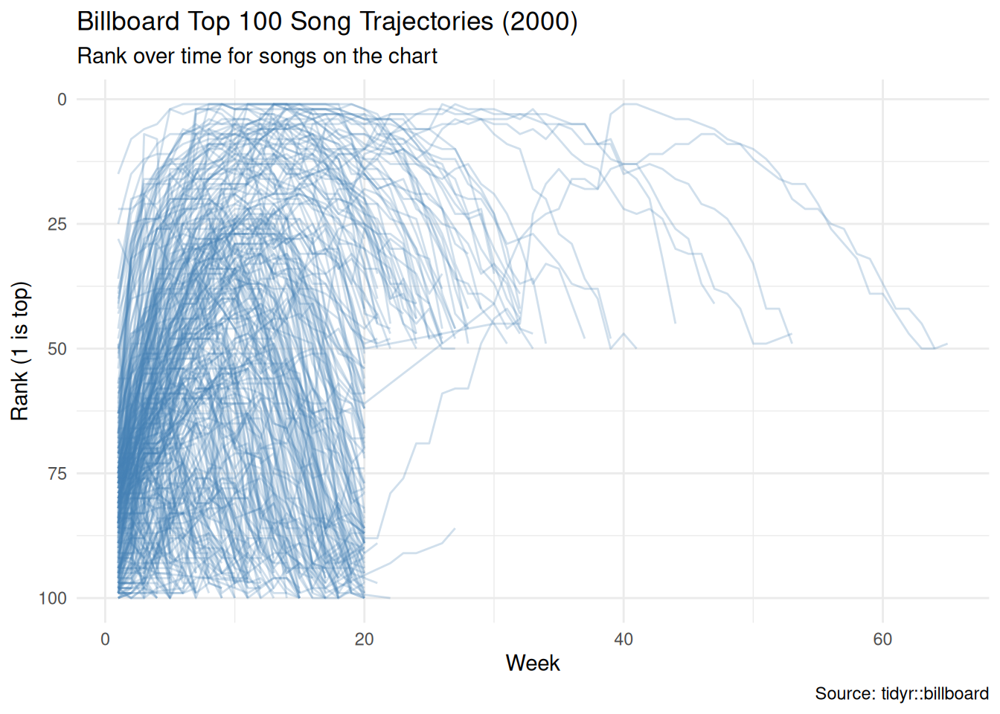
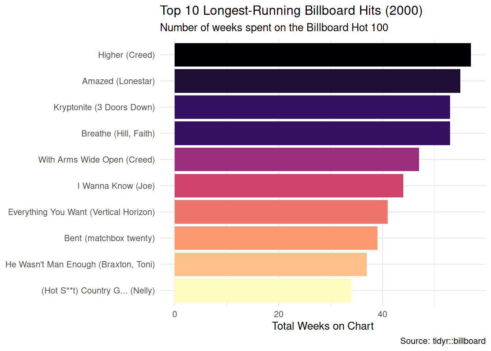

::: {.cell}

```{.r .cell-code}
library(tidyverse)
```
:::


::: {.cell}

```{.r .cell-code}
billboard |>
  pivot_longer(
    cols = starts_with("wk"),
    names_to = "week",
    values_to = "rank",
    values_drop_na = TRUE
  ) |>
  mutate(week = parse_number(week)) |>
  ggplot(aes(x = week, y = rank, group = track)) +
  geom_line(alpha = 0.25, color = "steelblue") +
  scale_y_reverse() +
  theme_minimal() +
  labs(
    title = "Billboard Top 100 Song Trajectories (2000)",
    subtitle = "Rank over time for songs on the chart",
    x = "Week",
    y = "Rank (1 is top)",
    caption = "Source: tidyr::billboard"
  )
```

::: {.cell-output-display}
{width=672}
:::
:::


::: {.cell}

```{.r .cell-code}
billboard |>
  pivot_longer(
    cols = starts_with("wk"),
    names_to = "week",
    values_to = "rank",
    values_drop_na = TRUE
  ) |>
  # Count how many weeks each song spent on the chart
  summarize(weeks_on_chart = n(), .by = c(artist, track)) |>
  slice_max(weeks_on_chart, n = 10, with_ties = FALSE) |>
  # Format label and order songs so the longest-charting appears on top
  mutate(
    song = paste0(track, " (", artist, ")"),
    song = fct_reorder(song, weeks_on_chart)
  ) |>
  ggplot(aes(x = weeks_on_chart, y = song, fill = weeks_on_chart)) +
  geom_col(show.legend = FALSE) +
  scale_fill_viridis_c(option = "magma", direction = -1) +
  theme_minimal() +
  labs(
    title = "Top 10 Longest-Running Billboard Hits (2000)",
    subtitle = "Number of weeks spent on the Billboard Hot 100",
    x = "Total Weeks on Chart",
    y = NULL,
    caption = "Source: tidyr::billboard"
  )
```

::: {.cell-output-display}
{width=672}
:::
:::


